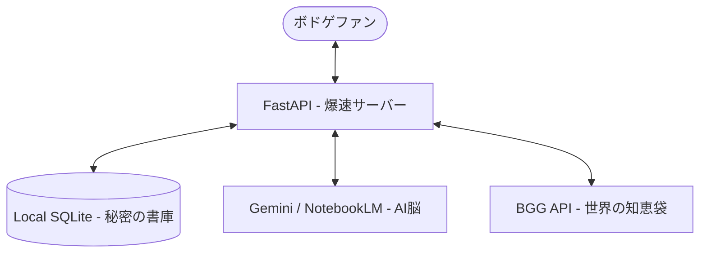

# 🎲 ボドゲのミカタ (Bodoge no Mikata) v2 だよっ！ 🧩

<div align="center">
  

  ### **「ルールを『読む』たいへんさから、ボドゲを『あそぶ』たのしさへっ！💖」**
  **AIちゃんがあなたの代わりにむずかしいマニュアルをぜーんぶ読み込んで、わかりやすく要約しちゃうコンパニオンだよぉ！✨**

  🚀 **ほんばんのサイトはこちらだよっ：** [ボドゲのミカタをひらく！](https://bodogenomikata2.pages.dev/)

  [](https://opensource.org/licenses/MIT)
  [](https://www.python.org/)
</div>

---

## 📖 私たちがたすける「4つのストーリー」

ボドゲであそぶときのお悩みを、最新のAIテクノロジーでかいけつしちゃうよぉ！💕

### 1️⃣ インスト時間をゼロにして、あそぶ時間をいっぱいにするよ！
> あつい説明書を1時間もかけて読んで、みんなに説明するのはもうおしまい！AIちゃんが「じゅんび」「ルール」「しょうりじょうけん」を3分でぎゅっと要約するよ！集まったらすぐダイスをふっちゃおう！🎲✨

### 2️⃣ えいごのルール・輸入ボドゲもこわくないよっ！
> 海外のめずらしいボドゲや、BGGで大人気のあのゲーム！英語のPDFマニュアルを渡すだけで、日本語のわかりやすい解説とインフォグラフィック（図解）を自動でつくっちゃうの！すごいでしょ！(๑•̀ㅂ•́)و✧

### 3️⃣ プレイ中に「あれ？」ってなってもスマホで解決！
> 「このアクション、どうやるんだっけ？」ってなったらスマホでサクッと確認できるよ！むずかしいことを考えずに、スムーズにゲームを楽しめるのっ！

### 4️⃣ 「おみみ」で聴くルール・インストだよ！
> じゅんびをしながら、AIちゃんのやさしい声でルールのポイントをきけちゃうの！まるでベテランのインスト担当の人がお隣にいるみたいで、とっても安心だよぉ！🎧

---

## 🔥 すごい機能 (Key Features)

- **AI High-Res Reconstruction**: Gemini 2.5 Flashさんによる、とっても高品質な日本語の解説づくり！
- **NotebookLM Content Pipeline**: ルールのPDFから「セットアップ」や「図解」を自動でつくる先進のパイプラインだよ！
- **Local-First Speed**: クラウドを使わないから、SQLiteで爆速でお返事できるの！
- **BGG Integration**: 世界最大のボードゲームデータベース（BoardGameGeek）から評価情報をリアルタイムでとってくるよ！

---

## 🛠️ アーキテクチャ (Architecture)

**「むだなものは一切なし（Zero-Fat）」**のすっきりしたエンジンだよ！

- **Backend**: FastAPI + Python 3.11
- **AI Brain**: Gemini 2.5 Flash / Google NotebookLM
- **Storage**: Local SQLite (`backend/games.db`)
- **Orchestration**: Taskfile / uv



---

## 📦 クイックスタート (Quick Start)

```bash
# 1. まほうのセットアップだよ！
task setup

# 2. サーバーをしょうかん！ (ポート 8000)
task dev

# 3. 好きなゲームを同期して生成するよ (例: Catan)
curl -X POST "http://localhost:8000/api/games/sync?game_name=Catan"
```

必ず毎回まずweb検索する

---

**Built with ❤️ for all Board Gamers by RuleScribe Games Team**
**「ルールブックの厚さは、もう楽しみの邪魔をさせないんだからねっ！」**
