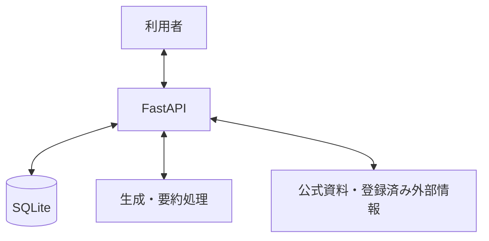

# ボドゲのミカタ — 出典付きボードゲーム補助

**公開サイト:** https://bodogenomikata2.pages.dev/

ボドゲのミカタは、ルールブックや公式FAQなどの出典を登録し、セットアップ、手番、合法手、終了条件、得点を検索しやすい補助情報へ変換するボードゲーム・コンパニオンです。

AIの説明を公式裁定として扱わず、公式ルール、抽出した事実、要約、翻訳、図解、人間レビューを区別します。

## 想定する利用場面

- ゲーム開始前の短時間インスト
- 英語ルールの日本語補助
- プレイ中のルール検索
- セットアップや得点処理の確認
- 音声による説明補助
- 複数サイトに分散したマーダーミステリー作品・版・販売・公演情報の出典付き統合
- マダミス100作から制作技法、独自性、人間的手触り、驚き、感情設計を分析

## 情報処理の流れ

```text
公式ルール・FAQ・登録済み資料
  → 出典箇所の抽出
  → 構造化されたルール事実
  → AI要約・翻訳・図解
  → 人間レビュー
  → API・Web・音声による補助表示
```

次の情報種別を分離して保持します。

- `OfficialRule` — 公式資料に書かれた内容
- `ExtractedFact` — 出典箇所から抽出した事実
- `AIGeneratedSummary` — AIが生成した要約
- `Translation` — 翻訳結果
- `DiagramInterpretation` — 図や盤面の解釈
- `DatabaseObservation` — DBに保存された観測値

AI生成文は出版社・デザイナーの公式文ではありません。版、出典URL、ページまたは節が欠ける回答は`require_source`として扱い、裁定根拠として断定しません。

機械可読な定義:

- [プロジェクト・オントロジー](ontology/project.yaml)
- [共通因果・証拠オントロジー](https://github.com/KAFKA2306/know/blob/main/ontology/causal-evidence-core.yaml)

## マダミス横断オントロジー

マーダーミステリーでは、作品そのものと、ウズ版・パッケージ版・店舗公演版などの版、販売条件、個別公演、レビュー集計を分離します。情報サイトごとの値は上書きせず、`SourceRecord`と`Assertion`で出典付きの主張として保持します。

- [中核モデル](ontology/murder-mystery/core.yaml)
- [統制語彙](ontology/murder-mystery/vocabulary.yaml)
- [マダミス.jp・マダナビ・ウズ・BOOTHの項目対応](ontology/murder-mystery/source-mappings.yaml)
- [正準レコードJSON Schema](ontology/murder-mystery/record.schema.json)
- [創作分析オントロジー](ontology/murder-mystery/creative-analysis.yaml)
- [非ネタバレ検証用レコード](ontology/murder-mystery/example-record.yaml)
- [人気100作の候補台帳](data/murder-mystery/popular-100-candidates.yaml)
- [100作の創作パターン調査](research/murder-mystery/creative-patterns-100.md)

### 人気100作の候補台帳

公開プレイ履歴、検討リスト、作者公式カタログから、重複を除いた100作品を非ネタバレの候補集合として登録しています。これは予約数・投票数・レビュー数などに基づく確定ランキングではありません。

- 100作品すべてに出典URLを保持
- 94作品に販売・配布・プラットフォームURLを保持
- 6作品は公開情報源上のタイトル確認だけで、公式URLの追加確認待ち
- 人気順位、評価、価格、人数、時間、GM要否は、一次情報を確認するまで未登録
- レビュー本文、画像、ハンドアウト、真相は収録しない

### 100作の創作性調査

100作すべてをタイトル表層で同一規則により一次コーディングし、公開あらすじ・公開システム説明を確認できた38作から、次の創作操作を抽出しています。

- 形式や媒体そのものの物語内化
- 関係性を密談・選択・個別結末へ変換する設計
- 喜劇と死、可愛さと喪失などの感情衝突
- 職業、共同体、生活の具体性
- 救済しない、不快さを残すなどの表現上のリスク
- 音楽、Web、改稿、難易度別版、他媒体展開の統合

「AIらしくなさ」を作者判定には使いません。固有語彙、社会的具体性、感情の矛盾、関係依存、表現上のリスクを`perceivedHumanTexture`として記述し、AI利用の有無は制作クレジットや来歴として別管理します。

分析と検証:

```bash
task creativity:check
task creativity:analyze
```

`creativity:check`は100件固定、連番、タイトル表層だけで許可される推論範囲、AI・人間作者判定の禁止を検証します。`creativity:analyze`は再生成可能な表層シグナルデータを出力します。

データ取得は、`manual_entry`、`official_api`、`creator_submission`、`seller_export`だけを許可します。スクレイピング、クローリング、自動HTML抽出、レビュー本文の転載、無許諾画像ホットリンクは実装しません。公式API仕様または書面による許諾が確認できるまで、各サイトの自動取得は無効です。

オントロジー検証:

```bash
task ontology:validate
```

この検証は、取得方式、参照整合性、人数・時間範囲、価格単位、統制語彙、100件固定、タイトル重複、出典URL、ネタバレ公開範囲を確認します。

## 技術構成

- Backend — FastAPI / Python 3.11
- Storage — SQLite (`backend/games.db`)
- AI生成 — 設定されたLLMと外部生成ワークフロー
- 実行管理 — Taskfile / uv


```mermaid
graph TD
    User[利用者] <--> API[FastAPI]
    API <--> DB[(SQLite)]
    API <--> AI[生成・要約処理]
    API <--> Sources[公式資料・登録済み外部情報]
```

## クイックスタート

```bash
task setup
task dev
```

ゲーム情報を同期する例:

```bash
curl -X POST "http://localhost:8000/api/games/sync?game_name=Catan"
```

## 利用時の確認事項

生成結果を公開、翻訳配布、裁定補助へ利用する前に、次を確認してください。

1. 対象ゲームと版が一致している
2. 出典URLが登録されている
3. ページまたは節が特定されている
4. 公式文とAI生成文が区別されている
5. 人間レビューの状態が確認できる
6. マダミスの公開データに重大なネタバレまたは真相が含まれていない
7. 外部サイト由来データの取得方法と権利状態が記録されている
8. 公開あらすじから伏線の公平性、実際の感動、作者性を推定していない

最終的な裁定、競技ルール、エラッタ、FAQは、出版社・デザイナー・大会運営の最新公式情報を優先してください。

**README最終監査:** 2026-08-02
