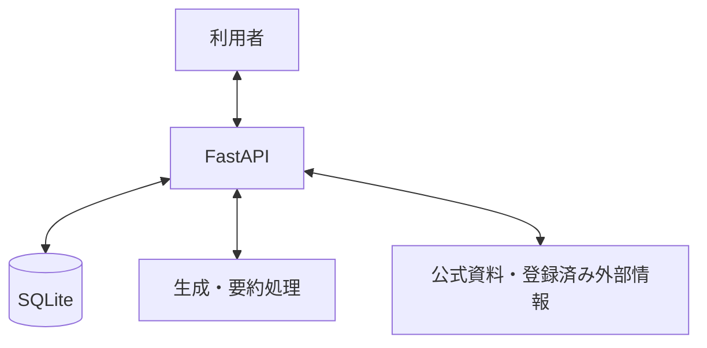

# ボドゲのミカタ — 出典付きボードゲーム補助

**公開サイト:** https://bodogenomikata2.pages.dev/

ボドゲのミカタは、ルールブックや公式FAQなどの出典を登録し、セットアップ、手番、合法手、終了条件、得点を検索しやすい補助情報へ変換するボードゲーム・コンパニオンです。

AIの説明を公式裁定として扱わず、公式ルール、抽出した事実、要約、翻訳、図解、人間レビューを区別します。

## 想定する利用場面

- ゲーム開始前の短時間インスト
- 英語ルールの日本語補助
- プレイ中のルール検索
- セットアップや得点処理の確認
- 音声による説明補助

## 情報処理の流れ

```text
公式ルール・FAQ・登録済み資料
  → 出典箇所の抽出
  → 構造化されたルール事実
  → AI要約・翻訳・図解
  → 人間レビュー
  → API・Web・音声による補助表示
```

次の情報種別を分離して保持します。

- `OfficialRule` — 公式資料に書かれた内容
- `ExtractedFact` — 出典箇所から抽出した事実
- `AIGeneratedSummary` — AIが生成した要約
- `Translation` — 翻訳結果
- `DiagramInterpretation` — 図や盤面の解釈
- `DatabaseObservation` — DBに保存された観測値

AI生成文は出版社・デザイナーの公式文ではありません。版、出典URL、ページまたは節が欠ける回答は`require_source`として扱い、裁定根拠として断定しません。

機械可読な定義:

- [プロジェクト・オントロジー](ontology/project.yaml)
- [共通因果・証拠オントロジー](https://github.com/KAFKA2306/know/blob/main/ontology/causal-evidence-core.yaml)

## 技術構成

- Backend — FastAPI / Python 3.11
- Storage — SQLite (`backend/games.db`)
- AI生成 — 設定されたLLMと外部生成ワークフロー
- 実行管理 — Taskfile / uv


```mermaid
graph TD
    User[利用者] <--> API[FastAPI]
    API <--> DB[(SQLite)]
    API <--> AI[生成・要約処理]
    API <--> Sources[公式資料・登録済み外部情報]
```

## クイックスタート

```bash
task setup
task dev
```

ゲーム情報を同期する例:

```bash
curl -X POST "http://localhost:8000/api/games/sync?game_name=Catan"
```

## 利用時の確認事項

生成結果を公開、翻訳配布、裁定補助へ利用する前に、次を確認してください。

1. 対象ゲームと版が一致している
2. 出典URLが登録されている
3. ページまたは節が特定されている
4. 公式文とAI生成文が区別されている
5. 人間レビューの状態が確認できる

最終的な裁定、競技ルール、エラッタ、FAQは、出版社・デザイナー・大会運営の最新公式情報を優先してください。

**README最終監査:** 2026-08-01
