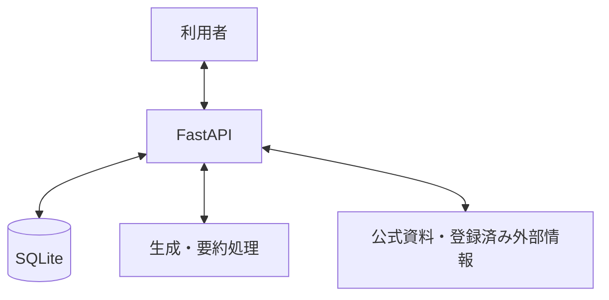

# ボドゲのミカタ（Bodoge no Mikata）

ルールブックや公式FAQなどの出典を登録し、セットアップ、手番、合法手、終了条件、得点を検索しやすい補助情報へ変換するボードゲーム・コンパニオンです。

- 公開サイト: https://bodogenomikata2.pages.dev/

## 因果・証拠オントロジー

上位システムは `BoardGameRuleAssistanceSystem` です。

```text
公式ルール・FAQ・登録済み資料
→ 出典箇所の抽出
→ 構造化されたルール事実
→ AI要約・翻訳・図解
→ 人間レビュー
→ API・Web・音声による補助表示
```

`OfficialRule`、`ExtractedFact`、`AIGeneratedSummary`、`Translation`、`DiagramInterpretation`、`DatabaseObservation`を区別します。AI生成文は出版社の公式文ではありません。版、出典URL、ページまたは節が欠ける回答は `require_source` とし、裁定根拠として断定しません。

- [プロジェクト・オントロジー](ontology/project.yaml)
- [共通因果・証拠オントロジー](https://github.com/KAFKA2306/know/blob/main/ontology/causal-evidence-core.yaml)

## 対象となる利用場面

- ゲーム開始前の短時間インスト
- 英語ルールの日本語補助
- プレイ中のルール検索
- セットアップや得点処理の確認
- 音声による説明補助

## アーキテクチャ

- Backend: FastAPI + Python 3.11
- Storage: SQLite (`backend/games.db`)
- AI生成: 設定されたLLMおよび外部生成ワークフロー
- Orchestration: Taskfile / uv


```mermaid
graph TD
    User[利用者] <--> API[FastAPI]
    API <--> DB[(SQLite)]
    API <--> AI[生成・要約処理]
    API <--> Sources[公式資料・登録済み外部情報]
```

## クイックスタート

```bash
task setup
task dev
curl -X POST "http://localhost:8000/api/games/sync?game_name=Catan"
```

生成結果を公開または裁定補助へ使う前に、該当する公式資料、版、出典箇所、生成状態を確認してください。