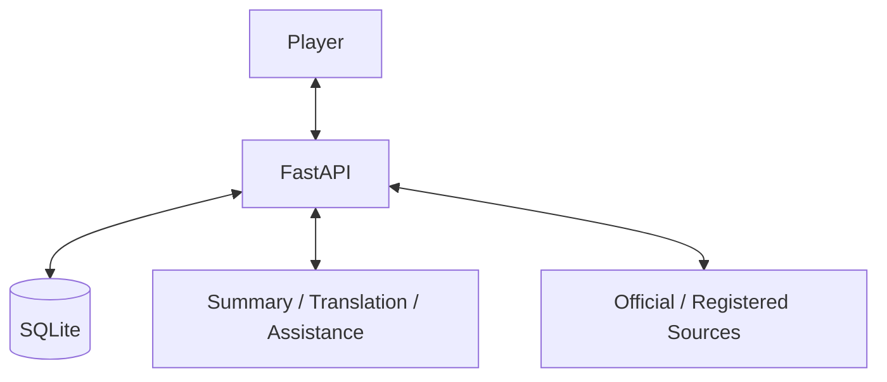

# ボドゲのミカタ

**プレイ中にルールで止まったとき、欲しいのは「それらしい答え」ではなく、すぐ使えて根拠へ戻れる答えです。**

同じゲームでも版・FAQ・エラッタで内容は変わります。翻訳・要約・図解には解釈が入り、AIが自然に答えても公式裁定とは限りません。

ボドゲのミカタは、公式ルール・FAQ・登録済み資料を出典付きで構造化し、**セットアップ、手番、合法手、終了条件、得点を素早く確認しながら「どこに書いてあったか」まで戻れるボードゲーム・コンパニオン**です。

- 公開サイト: https://bodogenomikata2.pages.dev/

## Vision

ルール確認を「全員が手を止めてPDFや検索結果を探す時間」から、**数十秒で論点を絞り、必要なら公式原文へ戻ってゲームを再開できる体験**へ変えます。

対象:

- ゲーム開始前の短時間インスト
- プレイ中のrule lookup
- 英語ルールの日本語補助
- setup / scoring確認
- 音声による説明補助
- 版・FAQ・公式リンクの確認
- マーダーミステリー作品の非ネタバレ情報整理・創作研究

## Design philosophy

- **Official text before generated prose.** AI要約・翻訳・図解を公式ruleと同一視しない。
- **Every ruling needs provenance.** game edition、source URL、page/sectionが不足する場合は`require_source`として断定しない。
- **Meaning types stay separate.** OfficialRule / ExtractedFact / AI summary / Translation / DiagramInterpretation / DatabaseObservationを混ぜない。
- **Version matters.** 同名gameでも版・FAQ・公演形態を一つへ潰さない。
- **Fast answer, reversible path.** 短い補助説明から元資料へ戻れる導線を残す。
- **No spoiler by default.** murder mysteryの公開dataへ真相・handout・重大spoilerを入れない。
- **No unauthorized collection.** external serviceはmanual entry / official API / creator submission / seller export等、許可境界が確認できる経路だけを使う。

## Why / 差別化

一般的なAI rule assistantは「答えを生成できること」が価値になりがちです。ボドゲのミカタは、**答えを出した後に、その文が公式ruleなのか、抽出事実なのか、翻訳・要約・解釈なのかを見分けられること**を中心にします。

FastAPI、SQLite、LLM、ontologyは差別化そのものではありません。これらは、速さを上げても裁定根拠を失わないための手段です。

## Player journey

```text
ルールで止まる
  → game / editionを指定
  → setup / turn / legal move / end / scoringを検索
  → short answer
  → evidence typeを確認
  → source page / FAQへ戻る
  → 必要なら公式裁定を優先
  → play再開
```

「AIが答えたから正しい」でflowを終わらせません。

## Evidence model

```text
OfficialRule
  ↓ extraction
ExtractedFact
  ↓ optional assistance
AIGeneratedSummary / Translation / DiagramInterpretation
  ↓ human review
API / Web / Voice assistance
```

別種として保持するもの:

- `OfficialRule`
- `ExtractedFact`
- `AIGeneratedSummary`
- `Translation`
- `DiagramInterpretation`
- `DatabaseObservation`

Machine-readable contracts:

- [Project ontology](ontology/project.yaml)
- [Causal/evidence core](https://github.com/KAFKA2306/know/blob/main/ontology/causal-evidence-core.yaml)

## Rule assistance boundary

公開・利用前に最低限確認するもの:

1. 対象gameが一致
2. editionが一致
3. source URLがある
4. page / sectionが特定できる
5. official textとgenerated proseが区別されている
6. human review stateが分かる

最終裁定、競技rule、errata、FAQはpublisher / designer / tournament organizerの最新公式情報を優先します。

## Murder mystery research surface

マーダーミステリーでは、作品・版・販売条件・公演・review aggregateを別entityとして扱います。

```text
Work
  ├─ Edition
  ├─ Distribution / Sale
  ├─ Performance
  └─ Source-backed assertions
```

主なontology:

- [core](ontology/murder-mystery/core.yaml)
- [vocabulary](ontology/murder-mystery/vocabulary.yaml)
- [source mappings](ontology/murder-mystery/source-mappings.yaml)
- [record schema](ontology/murder-mystery/record.schema.json)
- [creative analysis](ontology/murder-mystery/creative-analysis.yaml)
- [creative vocabulary](ontology/murder-mystery/creative-vocabulary.yaml)

### Popular-100 candidate ledger

`data/murder-mystery/popular-100-candidates.yaml` は、公開プレイ履歴・検討list・creator catalogから重複除去した100作品の**候補集合**です。

確定popular rankingではありません。

- source URLを全100件に保持
- price / player count / duration / GM requirement等は一次情報確認前に埋めない
- review本文・画像・handout・truthを収録しない

### Creative analysis boundary

公開あらすじで「泣ける」「驚く」と書かれていても、実際の感動・伏線公平性が実証されたとは扱いません。

区別するclaim:

- `observed_signal`
- `creator_promise`
- `audience_report`
- `executed_assessment`
- `authorized_text_observation`

`earned_emotion`、`foreshadowing_fairness`、`ending_integration`等は、実playまたは許諾済み本文を必要とします。

「AIらしくない」を作者判定には使いません。production creditとperceived human textureを別概念にします。

## Data acquisition boundary

許可する方式:

- `manual_entry`
- `official_api`
- `creator_submission`
- `seller_export`

公式API仕様または許諾を確認できるまで、scraping / crawling / automated HTML extraction / review転載 / unauthorized image hotlinkを実装しません。

## Quick start

```bash
task setup
task dev
```

Game sync example:

```bash
curl -X POST "http://localhost:8000/api/games/sync?game_name=Catan"
```

Ontology / creative research verification:

```bash
task ontology:validate
task creativity:ontology-check
task creativity:check
task creativity:analyze
```

## Architecture

- Backend: FastAPI / Python 3.11
- Storage: SQLite (`backend/games.db`)
- AI assistance: configured LLM / generation workflow
- Operations: Taskfile / uv


```mermaid
graph TD
    User[Player] <--> API[FastAPI]
    API <--> DB[(SQLite)]
    API <--> AI[Summary / Translation / Assistance]
    API <--> Sources[Official / Registered Sources]
```

## Repository map

```text
backend/                     game / rule API and storage
ontology/                    evidence / game / murder-mystery semantics
data/murder-mystery/         non-spoiler candidate ledgers
research/murder-mystery/     creative-pattern research
docs/                        contracts / source notes / product docs
Taskfile.yml                 canonical local operations
AGENTS.md                    agent working rules
```

## Safety checklist

利用前・公開前に確認:

- game / edition / source一致
- official vs generated区分
- review state
- spoiler boundary
- acquisition permission
- creator promiseをexecuted resultへ昇格していない
- edition / performanceごとの評価を混ぜていない
- production creditとauthor inferenceを混ぜていない

## Done

成功指標は登録game数やAI回答数ではありません。

**利用者がルールで止まったときに短時間で再開でき、その答えについて「何が公式で、何が補助解釈で、どの出典へ戻ればよいか」を説明できること**をDoneの中心に置きます。
